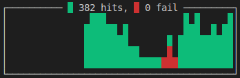

## Minikube Setup

[Install virtualbox](https://www.virtualbox.org/wiki/Linux_Downloads)

```
curl -Lo minikube https://storage.googleapis.com/minikube/releases/v0.28.2/minikube-linux-amd64 && chmod +x minikube && sudo mv minikube /usr/local/bin/
```

```
minikube start --memory=8192 --cpus=4 --kubernetes-version=v1.10.0 \
    --extra-config=controller-manager.cluster-signing-cert-file="/var/lib/localkube/certs/ca.crt" \
    --extra-config=controller-manager.cluster-signing-key-file="/var/lib/localkube/certs/ca.key"
```

## Istio Setup

```
kubectl create namespace istio-system
kubectl apply -f istio.yaml
```

## Setup application
Enable sidecar injection
```
kubectl label namespace default istio-injection=enabled
```

```
export GATEWAY_URL=$(minikube ip):$(kubectl get svc istio-ingressgateway -n istio-system -o 'jsonpath={.spec.ports[0].nodePort}')
```
## Install taurus

[Taurus](https://gettaurus.org/) is a tool to perform stress testing. I useded it to simulate users accessing the test service.

```
pip install bzt
```

```
bzt stress-test.yaml  -o settings.env.GATEWAY_URL=$GATEWAY_URL
```

## Trigger the 503 bug

To see the service unavailable bug just trigger a rolling update of the test deployment.

The behaviour that is seen is 503 http status codes when the update is triggered.



## Reference

Command used to generate the istio configuration:

```
helm template istio-1.0.2/install/kubernetes/helm/istio --name istio --namespace istio-system \
  --set gateways.istio-egressgateway.enabled=false \
  --set galley.enabled=false \
  --set prometheus.enabled=false \
  --set global.proxy.envoyStatsd.enabled=false  \
  --set gateways.istio-ingressgateway.type=NodePort > istio.yaml
```
